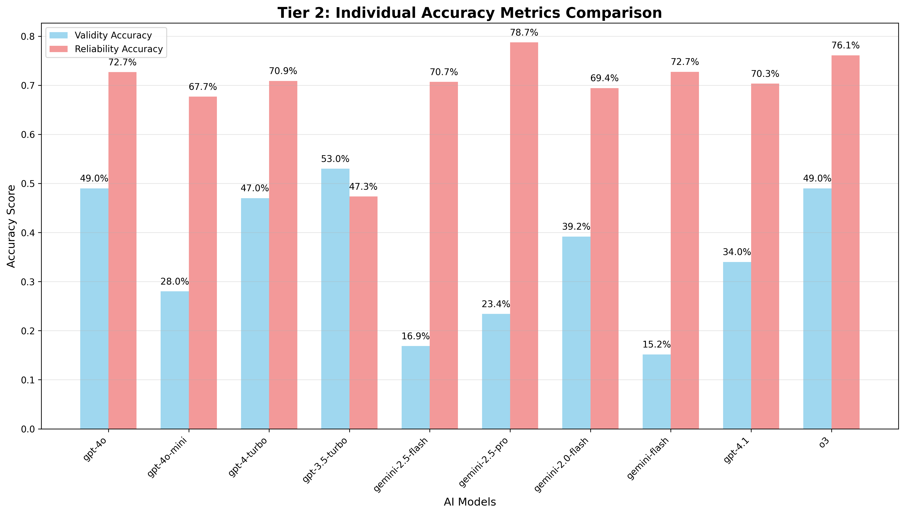
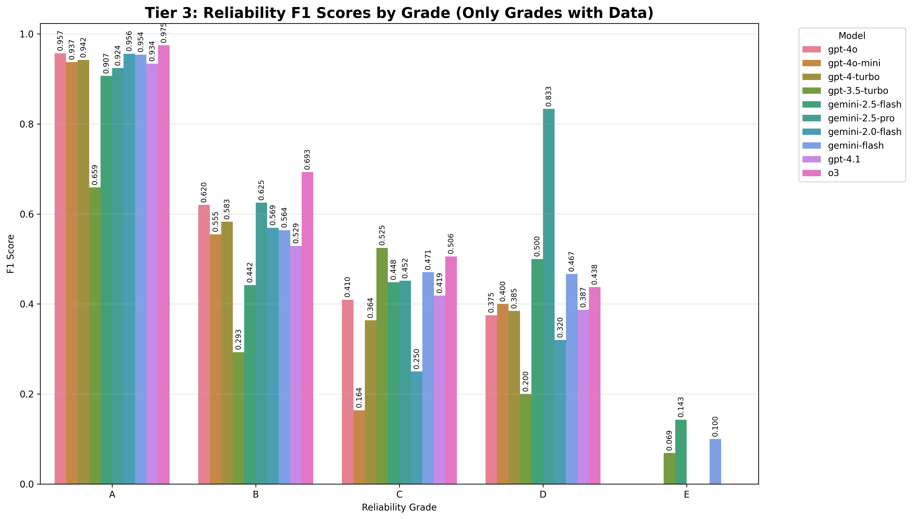

# A1Facts Benchmark Visualizations

This folder contains comprehensive visualizations for all three A1Facts benchmark datasets, organized by dataset and analysis type.

## Dataset-Specific Visualizations

### Manual 300 Dataset (Base Dataset - 300 Cases)
**Primary Focus: Strict Accuracy Analysis**


**Core Performance Charts:**
- `manual_300_tier1_strict_accuracy.png` - Strict accuracy where both validity AND reliability must be correct
- `manual_300_tier2_individual_accuracies.png` - Individual validity vs reliability performance comparison
- `manual_300_tier3_validity_by_level.png` - F1 scores for each validity level (1-6 scale)
- `manual_300_tier3_reliability_by_grade.png` - F1 scores for each reliability grade (A-F scale)

**Comprehensive Analysis:**
- `manual_300_comprehensive_dashboard.html` - Interactive dashboard for Manual 300 dataset
- `manual_300_comprehensive_report.md` - Detailed analysis report with key insights

### Triangulation 134 Dataset (Original Methodology - 134 Cases)
**Primary Focus: Relative Accuracy Patterns**


**Core Performance Charts:**
- `tier1_strict_accuracy.png` - Overall strict accuracy comparison across models
- `tier2_individual_accuracies.png` - Validity vs reliability accuracy analysis
- `tier2_accuracy_heatmap.png` - Heatmap visualization of model performance patterns




**Detailed Analysis:**
- `tier3_validity_f1_by_class.png` - Per-validity level F1 performance
- `tier3_reliability_f1_by_grade.png` - Per-reliability grade F1 performance
- `tier3_macro_f1_comparison.png` - Class-balanced macro F1 scores





**Interactive Analysis:**
- `tier1_strict_accuracy_interactive.html` - Interactive strict accuracy charts
- `comprehensive_dashboard.html` - Full triangulation dataset dashboard

### Synthesis 100 Dataset (Reasoning Quality - 100 Cases)
**Primary Focus: Reasoning Quality Assessment**


**Reasoning Quality Analysis:**
- `synthesis_reasoning_quality_analysis.png` - Comprehensive reasoning quality evaluation
- `synthesis_reasoning_quality_rankings.csv` - Detailed reasoning quality metrics

## Cross-Dataset Comparison


**Overall Performance:**
- `model_rankings.png` - Combined performance rankings across all datasets
- `model_rankings.csv` - Complete numerical data for all metrics and datasets

**Summary Reports:**
- `evaluation_summary_report.md` - Comprehensive analysis across all datasets
- `dataset_visualization_guide.md` - Guide to interpreting dataset-specific results

## Key Metrics Explained

### Strict Accuracy (Tier 1)
- **Definition**: Both validity rating AND reliability scores must be completely correct
- **Why Important**: Most demanding metric, reflects real-world accuracy requirements
- **Typical Range**: 5-20% (very challenging for AI models)

### Individual Accuracies (Tier 2)
- **Validity Accuracy**: Correct validity rating (1-6 scale)
- **Reliability Accuracy**: All source reliability scores correct (A-F grades)
- **Insight**: Shows whether models are better at validity vs reliability assessment

### F1 Scores (Tier 3)
- **Per-Class F1**: Precision and recall for each validity level / reliability grade
- **Macro F1**: Average F1 across all classes (handles class imbalance)
- **Usage**: Identifies which specific ratings/grades models struggle with

### Dataset-Specific Focus Areas

**Manual 300 Dataset:**
- **Strict Accuracy Focus**: Perfect balance across all reliability grades (A-F)
- **Key Insight**: Grade C reliability completely undetected by ALL models
- **Critical Finding**: Models show systematic bias toward extreme reliability ratings

**Triangulation 134 Dataset:**
- **Relative Accuracy Focus**: Original A1Facts methodology validation
- **Key Insight**: Models stronger at reliability assessment than validity assessment
- **Performance Range**: Best model achieves 23.9% strict accuracy

**Synthesis 100 Dataset:**
- **Reasoning Quality Focus**: Source integration and synthesis capabilities
- **Key Insight**: Reasoning quality varies significantly across models
- **Analysis Method**: Multi-dimensional reasoning assessment framework

## Regenerating Visualizations

To generate updated visualizations with new results:

```bash
# Manual 300 dataset visualizations
python visualize_manual_300.py

# Triangulation 134 dataset visualizations  
python visualize_triangulation.py

# Synthesis 100 dataset visualizations
python visualize_results.py

# Generate all dataset visualizations
python generate_all_visualizations.py
```

## Chart Usage Guidelines

### For Research Papers
- **Overall Comparison**: Use `model_rankings.png` for cross-dataset performance
- **Dataset-Specific**: Use `manual_300_tier1_strict_accuracy.png` for base dataset results
- **Detailed Analysis**: Reference CSV files for exact numerical values
- **Key Insights**: Include `manual_300_key_insights.png` for critical findings

### For Presentations
- **Start with**: Manual 300 dashboard (`manual_300_comprehensive_dashboard.html`)
- **Dataset Progression**: Show Manual 300 → Triangulation 134 → Synthesis 100 results
- **Interactive Exploration**: Use comprehensive dashboards for live analysis
- **Quick Comparison**: `tier2_accuracy_heatmap.png` for visual model comparison

### For Development Analysis
- **Base Performance**: Monitor Manual 300 charts for fundamental model capabilities
- **Methodology Validation**: Use Triangulation 134 for relative accuracy patterns
- **Advanced Capabilities**: Analyze Synthesis 100 for reasoning quality assessment
- **Error Analysis**: Use tier 3 charts to identify specific model weaknesses

## Dataset Visualization Strategy

1. **Manual 300 (Foundation)**: Establishes baseline model capabilities with balanced test cases
2. **Triangulation 134 (Validation)**: Confirms methodology effectiveness with original dataset
3. **Synthesis 100 (Advanced)**: Evaluates reasoning and synthesis capabilities

Each dataset provides unique insights into different aspects of model performance in factual assessment tasks.